# How to install and use the Nolej plugin for Moodle
This is the guide on how to install and use the plugin.

## Installation

1. Download the plugin into your moodle installation, in the directory `<moodle>/local/nolej`.

2. Login to your moodle installation as an admin.

3. You will be prompted to update the database.

    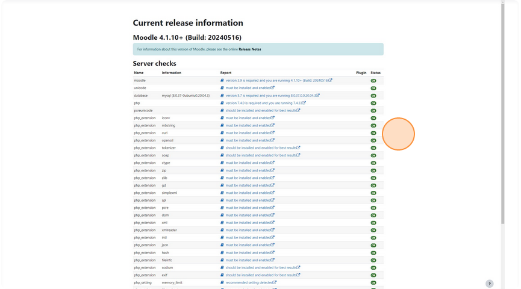

4. Click _Continue_.

    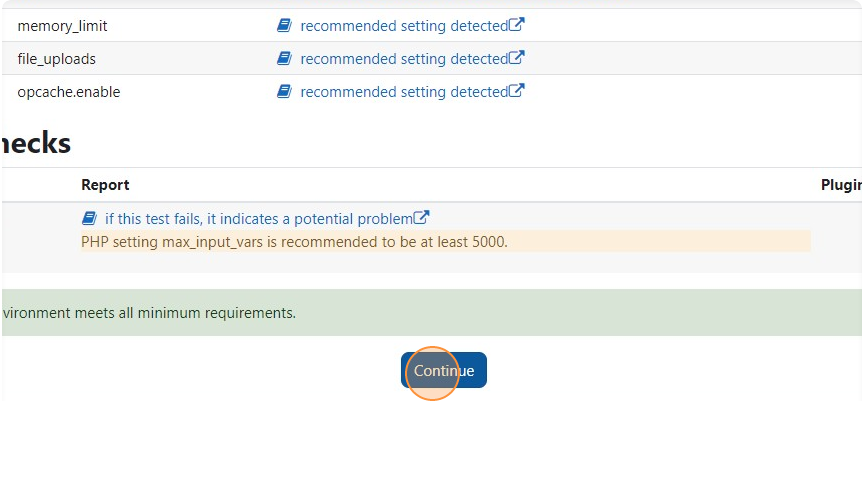

5. Click _Upgrade Moodle database now_ to install the plugin.

    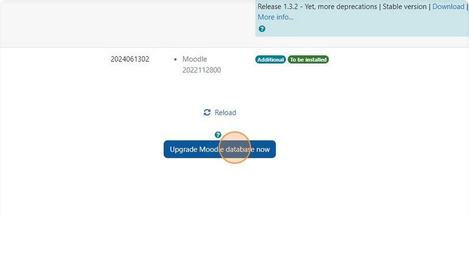

6. The plugin is installed. Click _Continue_.

    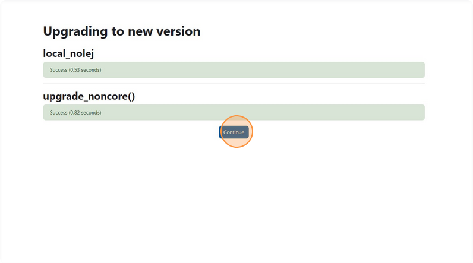

7. Enter your Nolej API Key.

    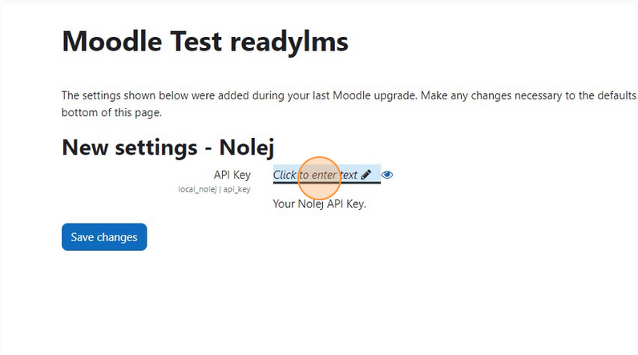

    **Note**: You can set the key or change it later on from the plugin settings.

8. Click on _Save changes_ to save the API Key.

    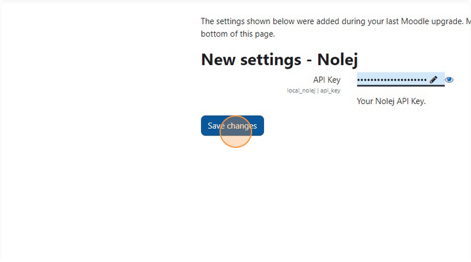

## Create a new Nolej Module

9. Navigate to your Nolej library.

    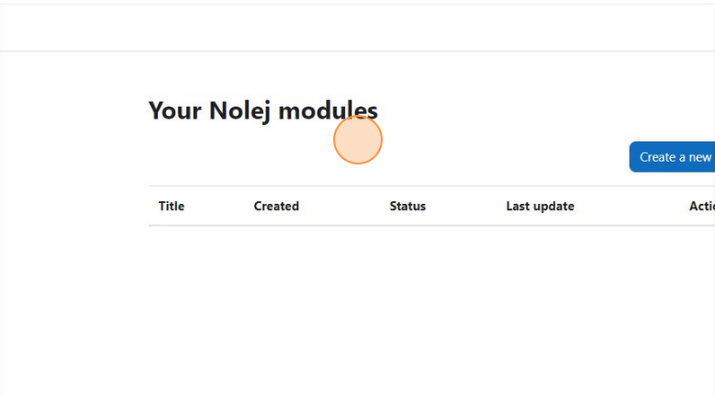

    **Note**: A link to the library should appear in the navigation menu, if the theme has it displayed.
    If not, there is a guide on how to insert a link to the library using Moodle blocks.

10. Click on _Create a new Nolej module_.

    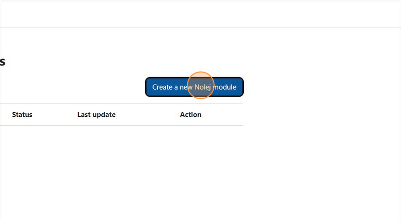

11. Type a title or leave it empty if you want the AI to generate a title for you.

    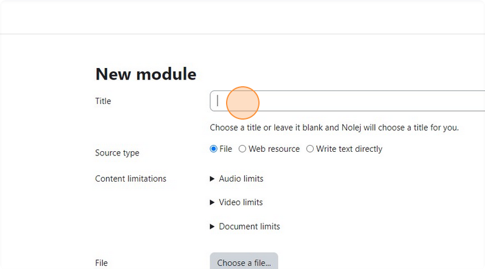

12. Choose the source type. Each source type has its own limits, please check them before submitting the request.

    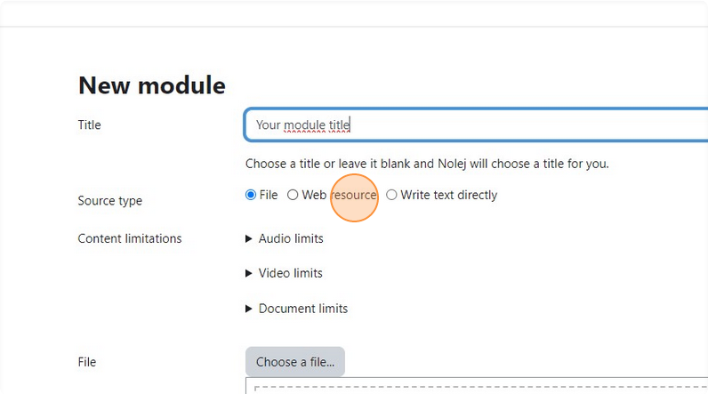

13. If you choose a web resource, like in this example, paste its URL here.

    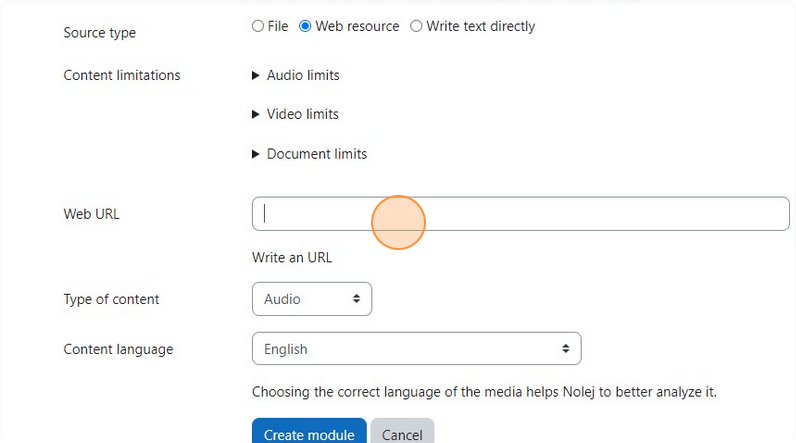

14. Choose if the web resource is an audio, or a video or the content of the web page.

    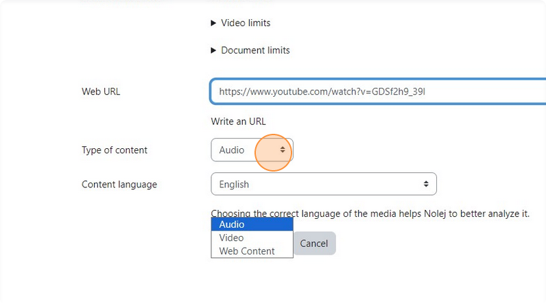

15. Choose the language of the resource submitted. This will help the AI to better analyze the media.

    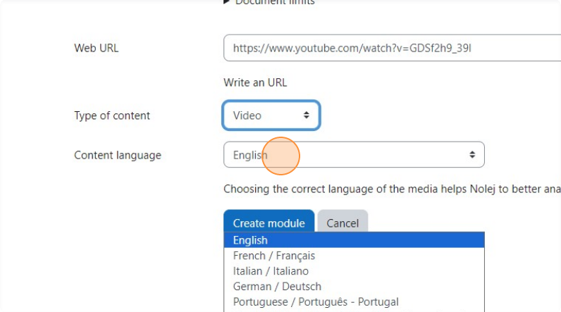

16. Click _Create module_.

    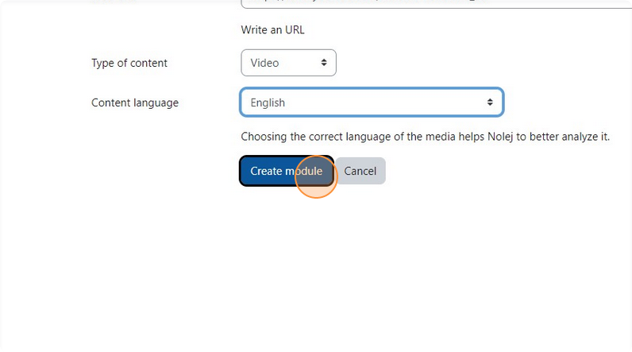

17. Now Nolej AI is processing the media to generate the transcription.

    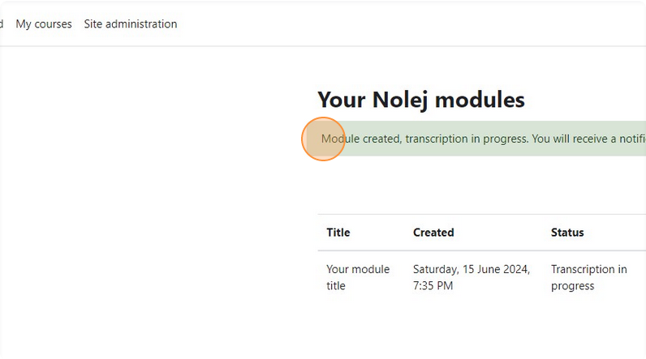

    **Note**: This operation is asynchronous, so you don't have to wait in this page for the result.
    You will receive a notification when it is ready.

## Analysis

18. Once the transcription has succeded, you can click on the notification to go to the Nolej module.

    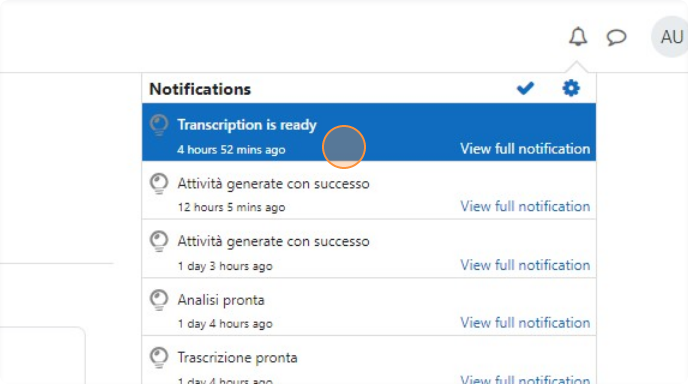

19. You can edit the "Title" field.

    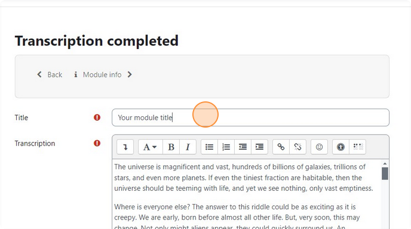

20. Check and edit the transcription given.

    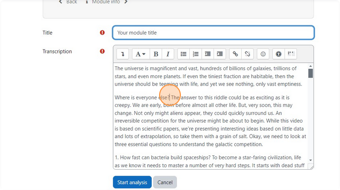

21. When you are satisfied with the transcription, click on _Start analysis_.

    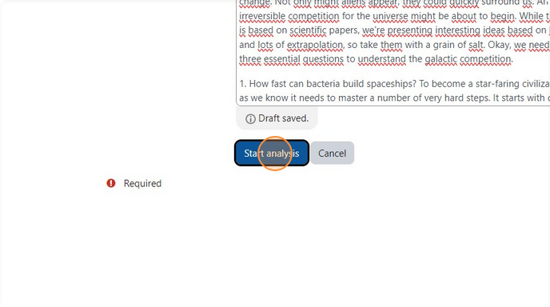

22. And confirm.

    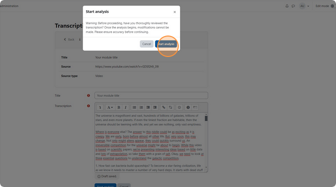

    **Note**: Again, you will receive a notification when the analysis is completed.

## Review

23. Once the analysis is ready, you can click on the notification to go to the module review.

    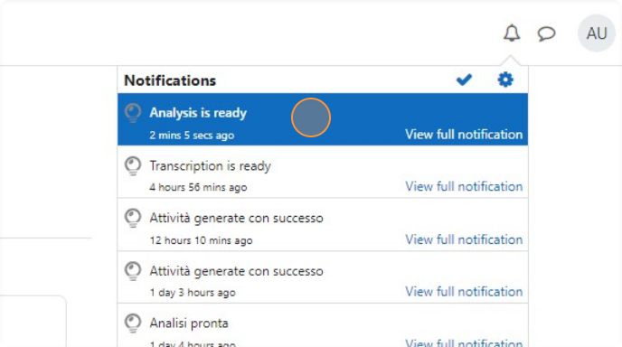

24. You can edit here all the concepts that Nolej provided.

    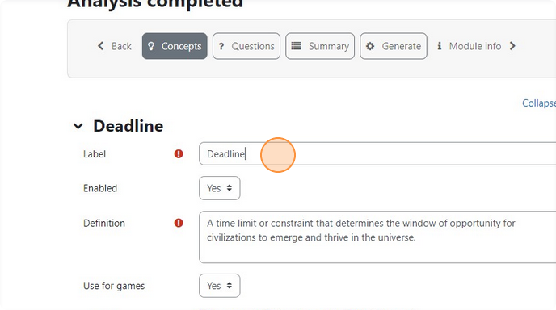

25. When satisfied, click on _Save concepts_.

    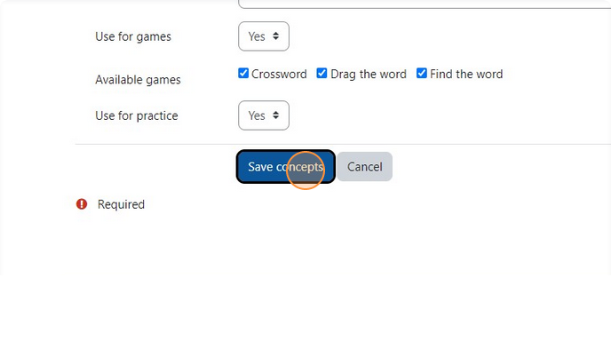

    **Note**: Concepts, questions and summary can be edited anytime.

26. Go to _Questions_.

    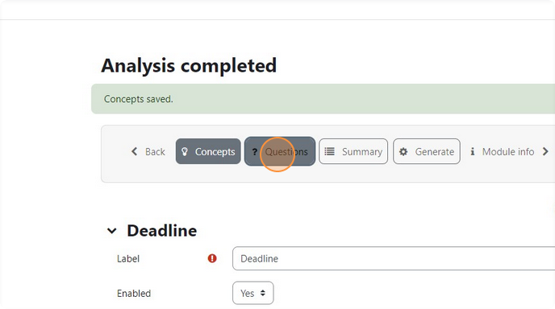

27. You can edit the several generated questions.

    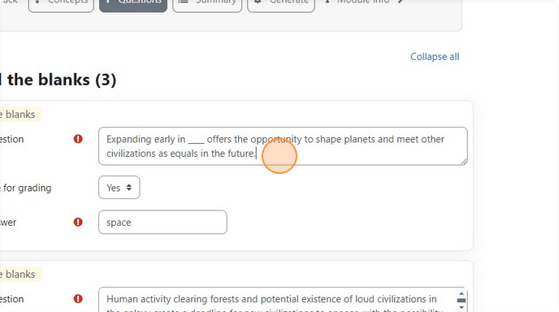

28. When satisfied, save the questions.

    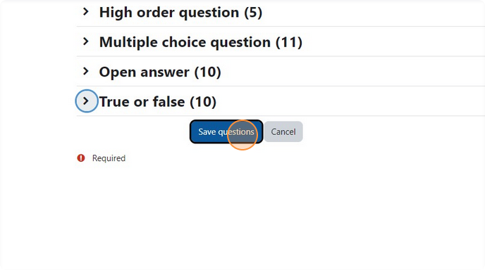

29. Go to _Summary_.

    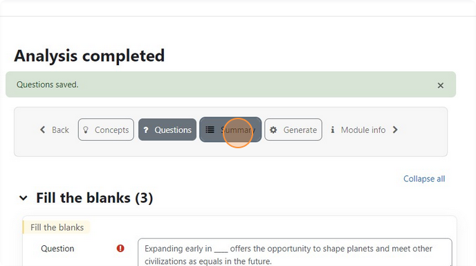

30. You can edit here the summary and the keypoints. If there are multiple paragraph in the summary, an abstract is generated too.

    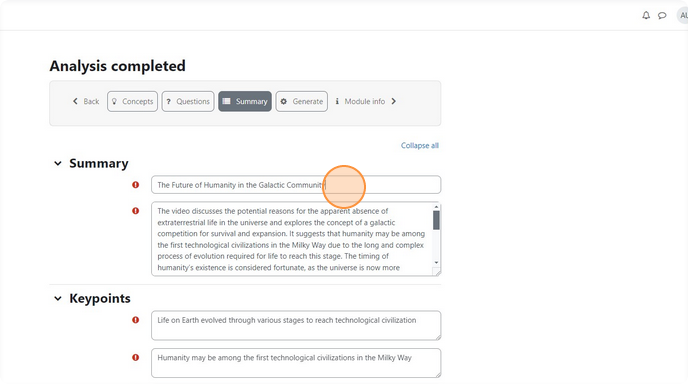

31. When satisfied, save the summary.

    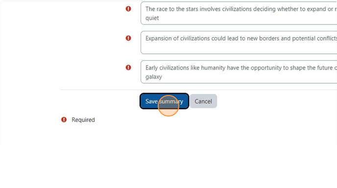

## Activity generation

32. Go to _Generate_.

    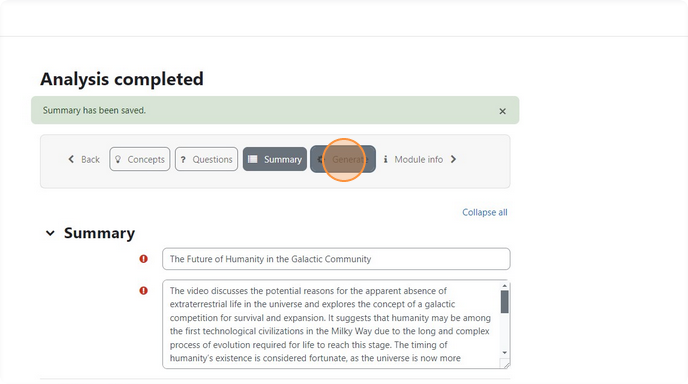

33. Edit here your preferences about the h5p activities that will be generated.

    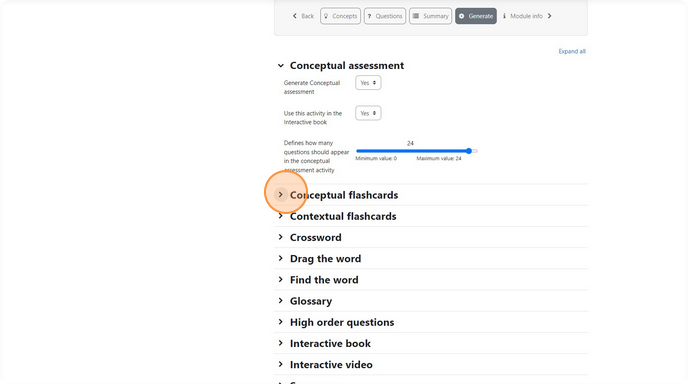

34. Now click on _Generate activities_.

    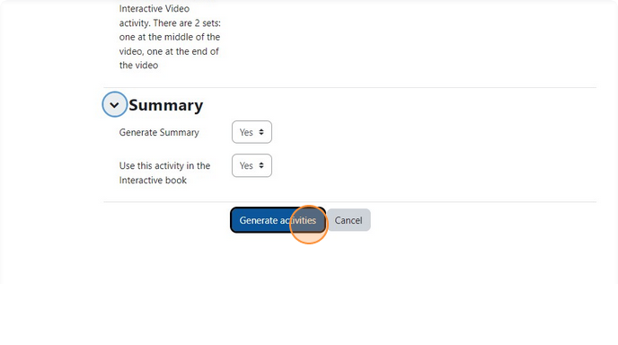

    **Note**: Again, you will receive a notification when the activities are ready.

35. When the activities are ready, you will see in the library a new button to preview them.

    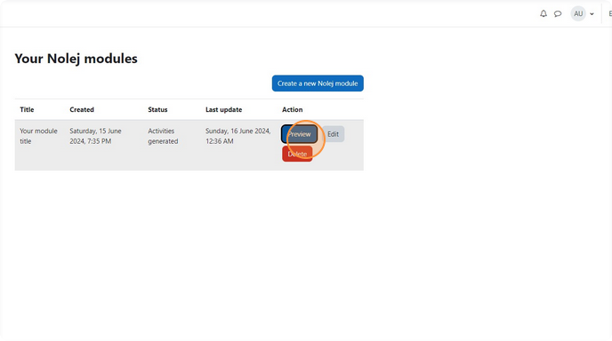

36. For example the _Interactive book_.

    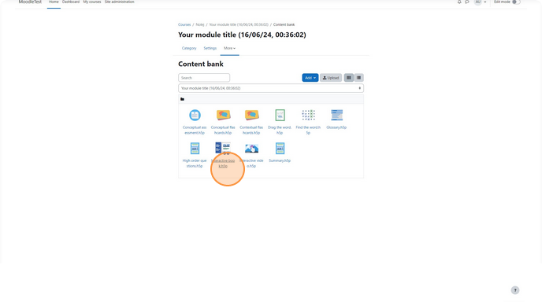

    **Note**: From here, you can also edit the h5p activities.

37. You can now use the h5p activities in your Moodle courses.

