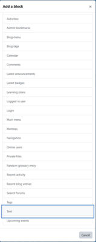
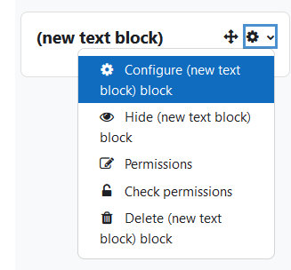
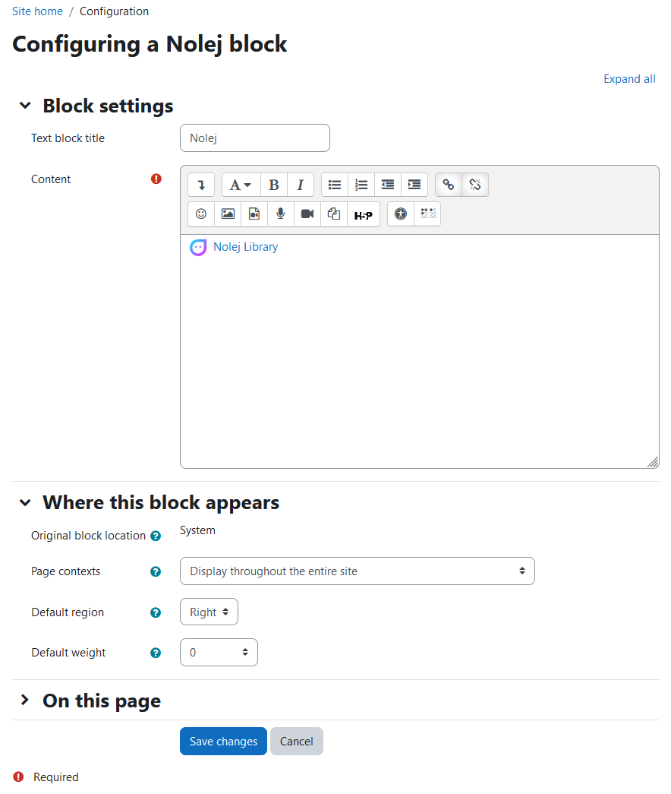
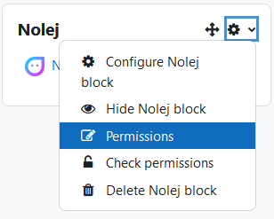
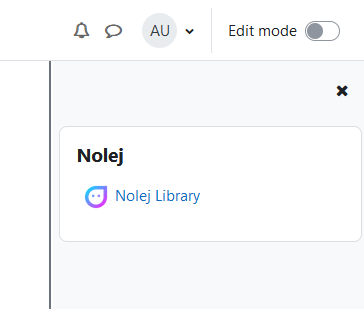

# How to create a link to the library, using Moodle blocks
Depending on the theme installed on your platform, the navigation menu to the library of Nolej may
not appear. If that's the case, this guide will help you create a link to the library using Moodle blocks.

## Prerequisites

* Plugin installed
* Administrator account

## Steps

1. **Log In and Enter Edit Mode**

   Once logged in as a platform administrator and in edit mode, locate the block management panel on
   the right side of the interface.

   

2. **Add a New Block**

   Add a new block by selecting the "Text" type from the list of available blocks.

   

   

3. **Configure the Text Block**

   Configure the text block by inserting the link to the Nolej library.

   * Title (Optional): Add a title to the block if necessary.
   * Content: Embed the Nolej plugin icon, which can be found at the address of your Moodle
     installation (`<moodle>/local/nolej/pix/nolej.png`).
   * Icon Dimensions: Set the icon dimensions, typically around 24x24 pixels, considering
     theme settings and font rendering. Center the icon and describe it as "Nolej Logo".

   

4. **Insert the Link**

   Save the image and proceed to insert the direct link to the Nolej library, located at the
   address of your Moodle installation (`<moodle>/local/nolej/manage.php`).

   * You can choose to open the link in a new window, based on your preference.

   

5. **Set Display Settings**

   Set the display of the text block for the entire Moodle platform and apply the changes.

   

6. **Verify Block Display**

   Ensure that the text block is displayed correctly.

   

7. **Manage Permissions**

   Verify and manage permissions related to the text block to ensure appropriate accessibility:

   * Remove permissions for "__adding new blocks__" and "__editing settings__" for all roles except
     administrators, if unnecessary.
   * Manage block display permissions based on the "__**usenolej**__" capability, allowing access
     only to authorized roles (e.g., managers, teachers).

   

   

8. **Return to Home Page**

   Once permission configuration is complete, go back to home page.

9. **Exit Edit Mode**

   Exit edit mode to finalize the changes.

## Conclusions

The link to the Nolej library will now be visible among the available blocks on the right side
of the Moodle interface.

