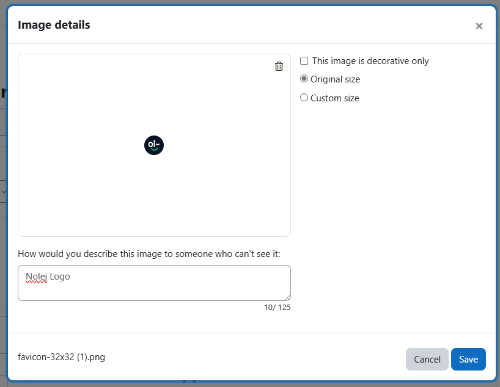

# How to create a link to the library, using Moodle blocks
Depending on the theme installed on your platform, the navigation menu to the library of Nolej may
not appear. If that's the case, this guide will help you create a link to the library using Moodle blocks.

## Prerequisites

* Plugin installed
* Administrator account

## Steps

1. **Log In and Enter Edit Mode**

    Once logged in as a platform administrator and in edit mode, locate the block management panel on
    the right side of the interface.

    

2. **Add a New Block**

    Add a new block by selecting the "Text" type from the list of available blocks.

    

    

3. **Configure the Text Block**

    Configure the text block by inserting the link to the Nolej library.

    * Title (Optional): Add a title to the block if necessary.
    * Content: Embed the Nolej plugin icon, which can be found at the address of your Moodle
      installation (`<moodle>/local/nolej/pix/nolej.png` or `<moodle>/local/nolej/pix/nolej_white.png`).
    * Icon Dimensions: Set the icon dimensions, typically around 49x46 pixels, considering
      theme settings and font rendering. Center the icon and describe it as "Nolej Logo".

    

4. **Insert the Link**

    Save the image and proceed to insert the direct link to the Nolej library, located at the
    address of your Moodle installation (`<moodle>/local/nolej/manage.php`).

    * You can choose to open the link in a new window, based on your preference.

    

5. **Set Display Settings**

    Set the display of the text block for the entire Moodle platform and apply the changes.

    

6. **Verify Block Display**

    Ensure that the text block is displayed correctly.

    

7. **Manage Permissions**

    Verify and manage permissions related to the text block to ensure appropriate accessibility:

    * Remove permissions for "__adding new blocks__" and "__editing settings__" for all roles except
      administrators, if unnecessary.
    * Manage block display permissions based on the "__**usenolej**__" capability, allowing access
      only to authorized roles (e.g., managers, teachers).

    

    

8. **Return to Home Page**

    Once permission configuration is complete, go back to home page.

9. **Exit Edit Mode**

    Exit edit mode to finalize the changes.

## Conclusions

The link to the Nolej library will now be visible among the available blocks on the right side
of the Moodle interface.


## Other propisitions of block or navigation

### Banner block

1. **Download banner images**

    Choose the banner matching the best your themes (banners can be found here: [Moodle Banner Link](https://bit.ly/nolej-moodle-templates))

2. **Log In and Enter Edit Mode**

    Once logged in as a platform administrator and in edit mode, locate the block management panel on the right side of the interface.

    

3. **Add a New Block**

    Add a new block by selecting the "Text" type from the list of available blocks.

    

    

4. **Configure the new block**

    First add a tittle like `🪄 Nolej`, then insert a image and select the banner downloaded before.

    

    You can use original size or find the one who fit the best for your theme

5. **Configure the link**

    Click on the banner then on the link button

    

    Configure the link as below with
    ```
    title => Geneate e-learning in minutes
    URL => <moodle>/local/nolej/manage.php
    ```

    


6. **Save and permissions**

    You can follow `step 5 to 9` of `Steps`


### In the navigation bar

1. **Access Site administration**

   In Site administration go in **Appearance** and found the theme settings

2. **Custom Menu Items**

    If alreay created add `🪄 Nolej | <moodle>/local/nolej/manage.php` to the menu else create a new menu with
    ```
    More
    🪄 Nolej | <moodle>/local/nolej/manage.php
    ```


